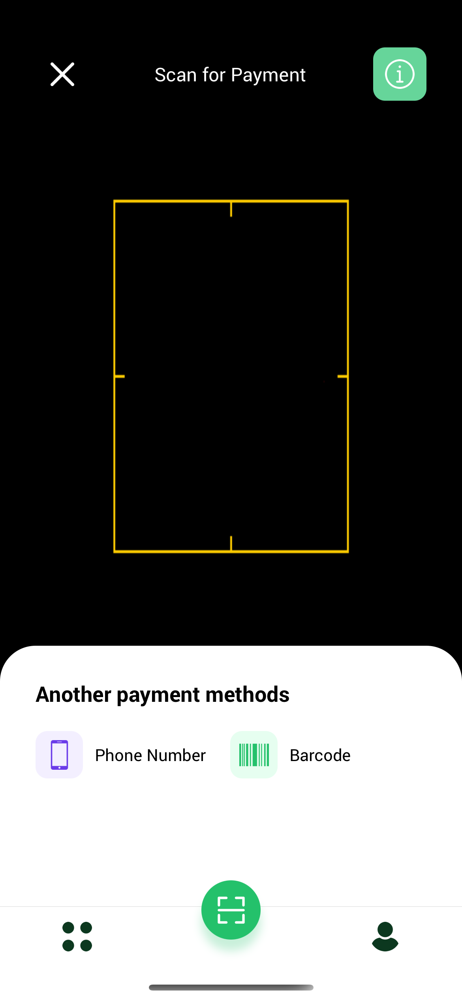
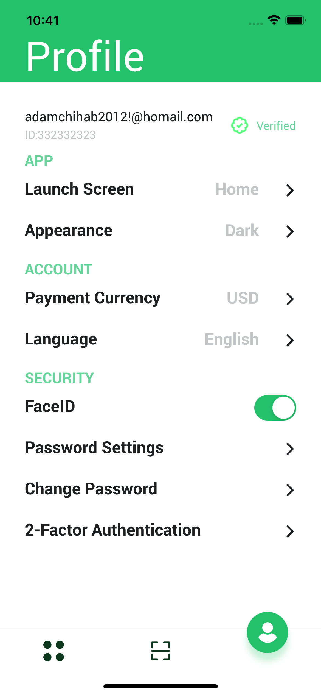
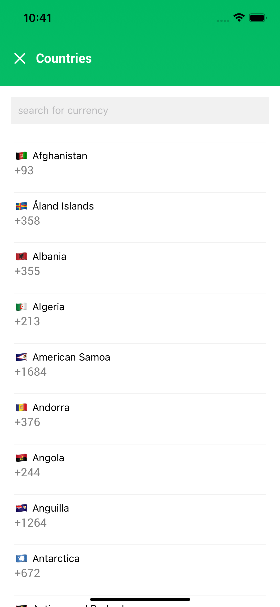
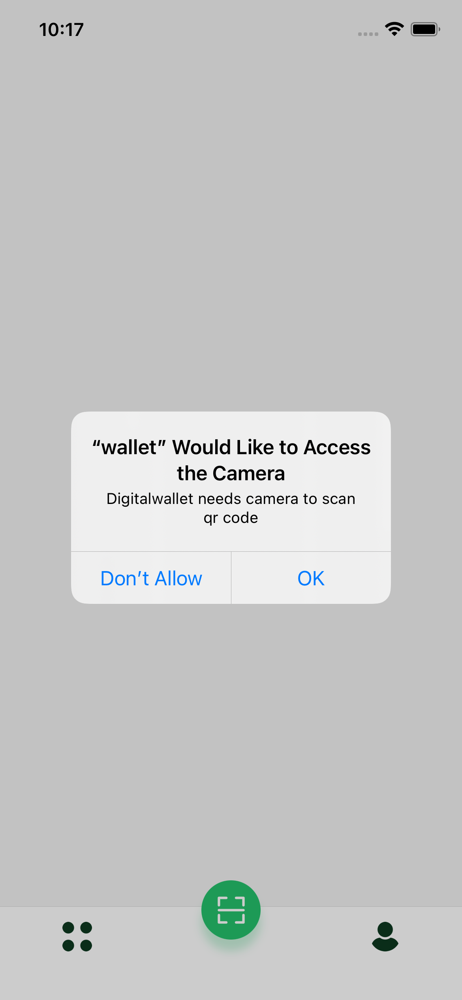

# React Native App with QR Scan

React native app with QR reader via camera.

#### Main technologies used

- [React Native](https://github.com/facebook/react-native)

> A framework for building native apps with React.

- [Redux](http://redux.js.org/)

> Redux is a predictable state container for JavaScript apps.

> React Native Navigation API

## How to use?

1. Download or clone this repo.

2. Install dependencies.

```js
npm install
// or
yarn install
```

3. Run project on iOS / Android.

```js
 npm run ios // npm run android
 // or
 yarn ios // yarn android
```

## Preview

<p align="center">
  
  
  
  
  
  
  
</p>
